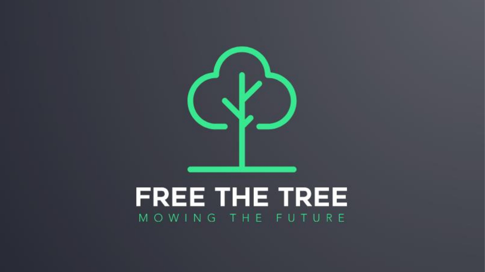
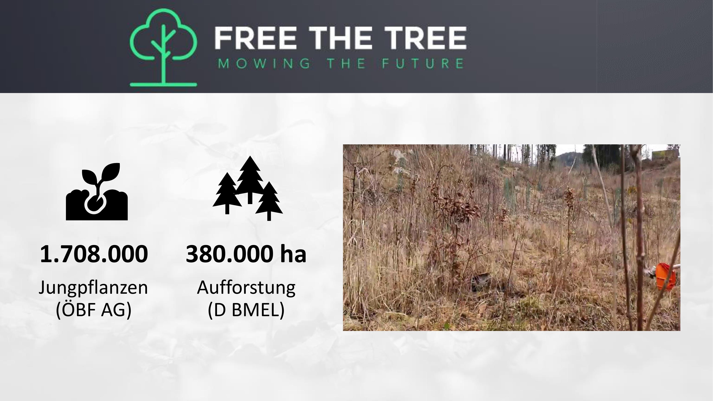
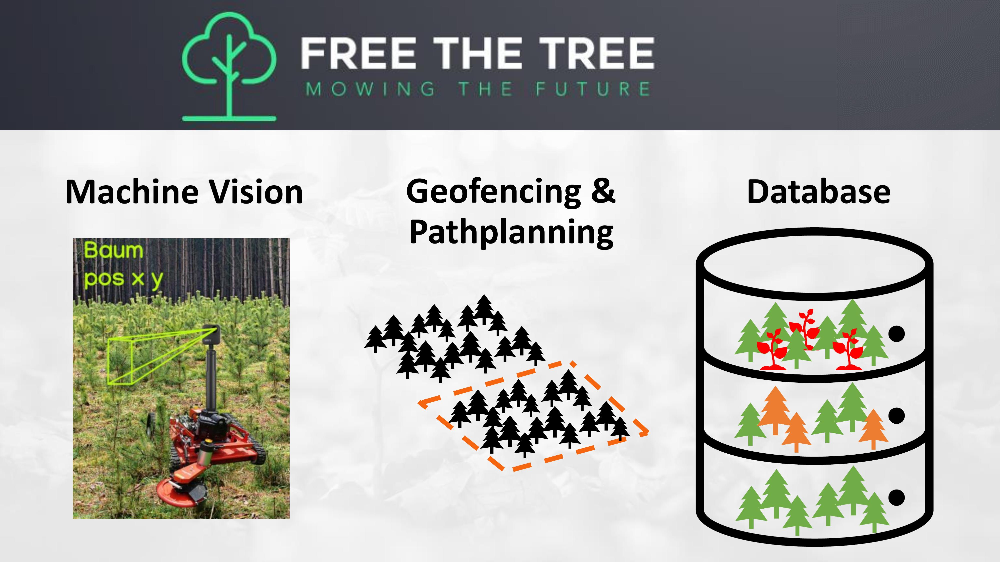
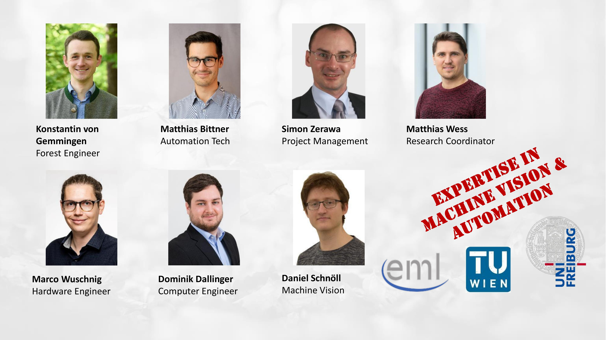
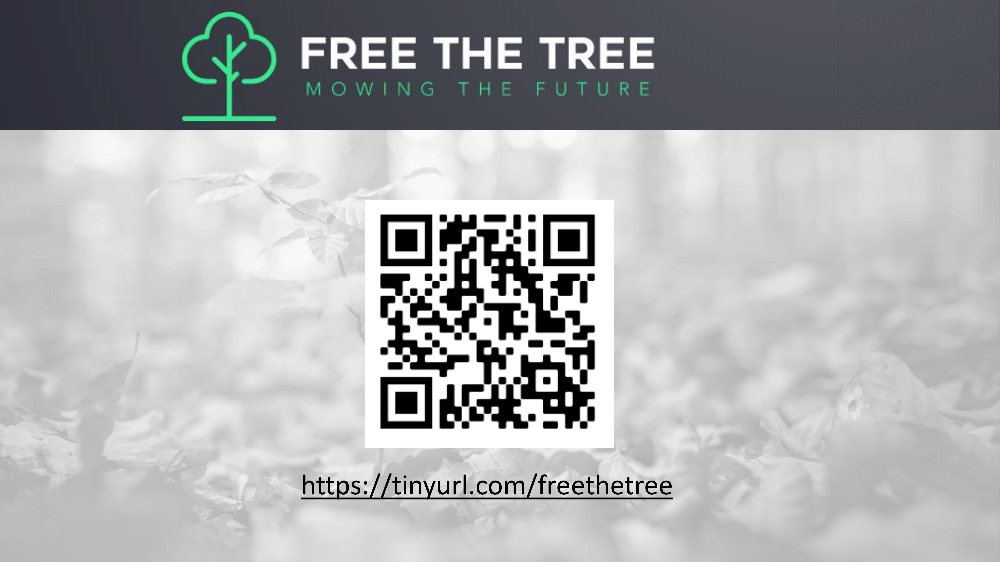
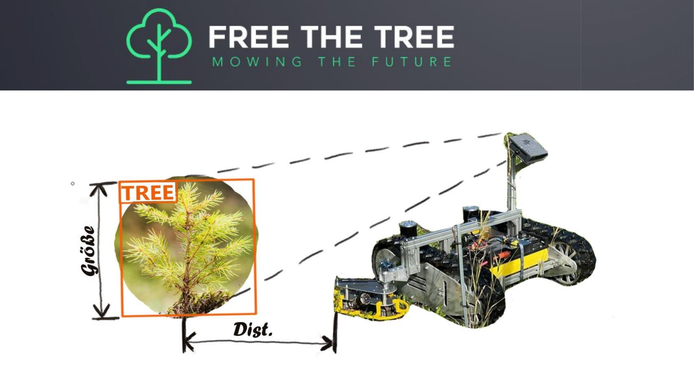

## Präsentation

## Kontakt

Marco Wuschnig marco.wuschnig@tuwien.ac.at

Adress: Gusshausstrasse 27-29/384, 1040 Vienna, Austria, 3rd floor, Room CB 0316

## „Free the tree“ – ein autonomer Mähroboter für Aufforstungsflächen
## Problem:
- Aufforstungsflächen verursachen einen hohen manuellen Arbeitsaufwand in den Sommermonaten
- Durch Klimawandel sind zunehmende Dürren und somit Freiflächen zu erwarten
- Aufwände für Ausmähen steigen stetig
- qualifiziertes Personal steht absehbar nicht mehr für Ausmähen zur Verfügung
- Autonome Mähroboter bieten Möglichkeit der Entlastung der Situation
##  Lösungsmöglichkeit
„Free the tree“ – ein autonomer Mähroboter für Aufforstungsflächen

Dieser ist in der Lage:
- Entstandene Aufforstungsflächen zu mähen
- Frühzeitige Flächendigitalisierung sicherzustellen
- Optimierte Arbeitsbedingungen für beteiligte Personen
### Umsetzung:
- Aufrüstung vorhandener Mähroboter (Schlegelmulcher mit Seitenmähwerk)
- Geofencing zur Flächenabgrenzung befahrbarer und vor Pflanzung gemulchter Aufforstungsflächen
- Kameras und Lidar-Sensoren ermöglichen Echtzeit-Pfadplanung on board
- Baumerkennung und Positionierung vor Ort mit Maschinen-Learning-Ansatz
### Zielsetzung:
- Modulares stufenweises Autonomiemodell für maßgeschneiderte Individuallösungen
- Große Waldeigentümer
- Forstliche Lohnunternehmer
## Nächste Schritte
- Partnersuche (Mähroboterhersteller)
-  Geeignete Testflächen
- Präzise Anforderungsdefinition

